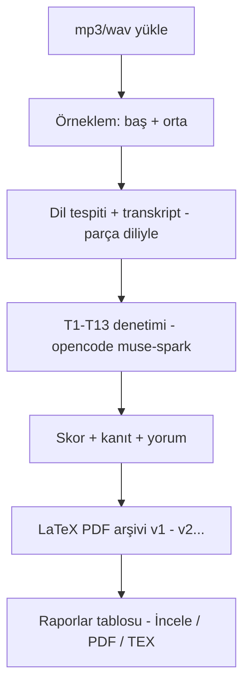

<div align="center">

# ◉ web-speech-project

### HİA Alo124 Kalite Denetim — Ses → Transkript → T1-T13 Skor → LaTeX Rapor

**faster-whisper** · **opencode muse-spark 1.3** · **tectonic LaTeX** · **FastAPI + statik web**

   

</div>

---

## ✨ Neler yapıyor?

| # | Yetenek | Motor |
|---|---------|-------|
| 1 | 🎙️ Ses yükleme (wav mp3 m4a aac ogg flac mp4) | ffmpeg + tarayıcı |
| 2 | ✂️ Örneklem: baştan + ortadan 2 parça | backend |
| 3 | 🌍 Parça bazında dil tespiti + o dilde transkript | faster-whisper (tiny→medium) |
| 4 | ✅ T1-T13 TÜİK uyum denetimi (kanıt + yorum) | opencode · muse-spark 1.3 |
| 5 | 📄 LaTeX PDF + HTML rapor (tüm meta ile) | tectonic |
| 6 | 🗂️ Rapor arşivi + versiyonlama (v1, v2…) | SQLite |

---

## 🚀 Çalıştır

```bash
# 1) backend (ilk sefer model indirir)
cd backend
python3 -m venv .venv && source .venv/bin/activate
pip install -r requirements.txt   # + fpdf2 (yedek), opencode CLI kurulu olmalı
uvicorn app:app --port 8001

# 2) arayüz (başka terminal)
cd ..
python3 -m http.server 8000
```

Aç → **http://localhost:8000** · Sağlık → http://localhost:8001/health

> Gerekenler: `ffmpeg` · `tectonic` · `opencode` CLI (`brew install ffmpeg tectonic ollama` — ollama şart değil)

---

## 🔁 Akış



---

## 📊 Denetim kriterleri (T1-T13)

<details>
<summary><b>Kriter listesini aç</b></summary>

- **T1** — Kurum + araştırma adı (tam: *Hanehalkı İşgücü Araştırması*) + kayıt bildirimi (üçü de şart)
- **T2** — Kişinin kendisiyle görüşme (proxy uyarısı)
- **T3-T11** — S32…S89 soruları: net referans tarih, kritik ifadeler (*1 saat*, *daha fazla gelir*…)
- **T12** — Yönlendirme var mı? (ters polarite)
- **T13** — Saygılı / nazik tutum

Sonuçlar: `evet` / `hayır` / `belirsiz` + puan + kanıt alıntısı + yorum. Referans hafta prompt'a parametre olarak verilir.

</details>

---

## 🖥️ Ekranlar

- **Çalışma** — dosya bırak → model + dil + referans hafta → canlı aşama (*opencode analiz ediyor…*) → transkript + skorlar + denetim kartı
- **Raporlar** — arşiv tablosu (dosya, versiyon, skor, model, dil) → İncele / HTML / PDF / TEX / Sil / **Tekrar Skorla → v2**

---

## 📁 Yapı

```
web-speech-project/
├── index.html · app.js · styles.css   # servis bazlı arayüz
├── backend/
│   ├── app.py        # FastAPI: jobs, records, reports, rescore
│   ├── analyze.py    # T1-T13 meta-prompt (opencode CLI)
│   ├── report.py     # HTML önizleme
│   └── report_tex.py # LaTeX .tex + tectonic PDF
└── samples/          # test sesleri
```

---

<div align="center">

*100% yerel · API anahtarı yok · TÜİK HİA denetimi için*

**TÜİK eğitimi kapsamında [@gurkanfikretgunak](https://github.com/gurkanfikretgunak) tarafından geliştirilmiştir.**

</div>
